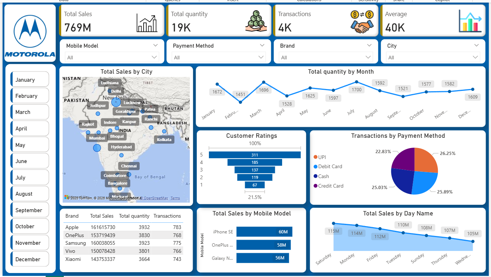

# PowerBI-Mobile-Sales-Dashboard
**Interactive Power BI dashboard analyzing mobile sales performance, customer behavior, and regional trends.**

## 📸 Dashboard Preview

**📌 Project Overview-**

This project presents an interactive Mobile Sales Dashboard built using Microsoft Power BI to analyze sales performance, customer behavior, and regional trends. The dashboard is designed to support data-driven business decisions through clear KPIs and visual storytelling.

**🎯 Business Objectives-**

-Track overall sales performance and growth trends.
-Identify top-performing mobile brands and models.
-Analyze regional (city-wise) sales distribution.
-Understand customer preferences through ratings and payment modes.
-Enable quick insights for sales, marketing, and inventory planning.

**📈 Key Insights & Features-**

-💰 Total Sales, Units Sold, Transactions & Average Sales KPIs
-📱 Top-selling mobile brands and models
-🗓️ Monthly and day-wise sales trend analysis
-🌍 City-level sales visualization using map charts
-⭐ Customer ratings analysis
-💳 Payment mode distribution (UPI, Card, Cash)
-🎛️ Interactive slicers for brand, model, city, and time period

**🛠️ Tools & Technologies-**

-Microsoft Power BI
-DAX (Measures & Calculated Columns)
-Data Modeling
-Data Cleaning & Transformation
-Sales & Business Analytics

**🧠 Skills Demonstrated-**

-Data analysis and KPI design.
-Dashboard design & data visualization.
-Business-oriented insight generation.
-Analytical thinking and storytelling.
-Stakeholder-focused reporting.

**🚀 Use Case**

-This dashboard can be used by:
-Sales Managers
-Business Analysts
-Marketing Teams
-Retail & E-commerce decision-makers

**📬 Connect With Me**

If you have feedback or would like to discuss data analytics, feel free to connect with me on LinkedIn.

https://www.linkedin.com/in/vaishnavi-timune-4a1087212 

**THANK YOU**

